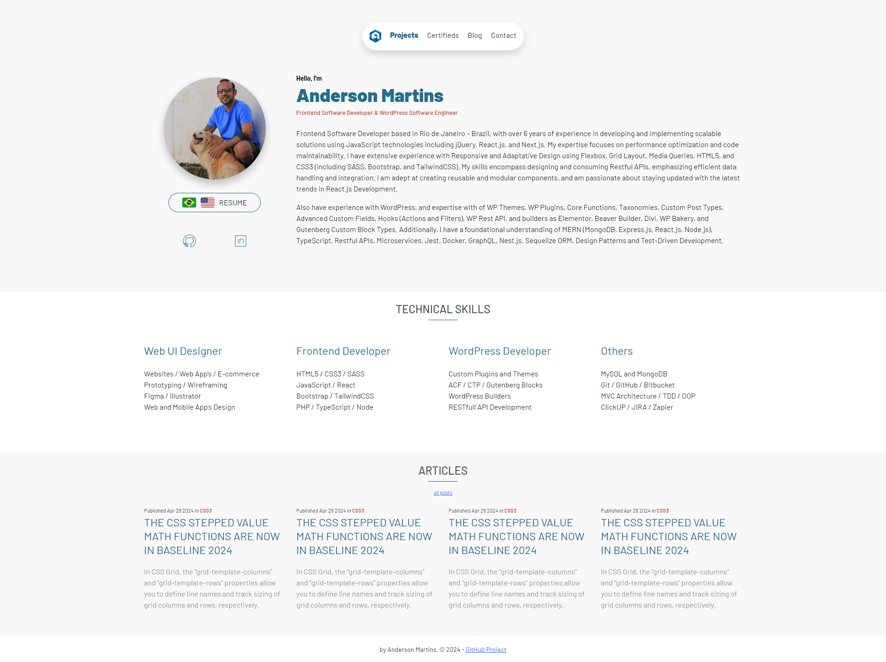
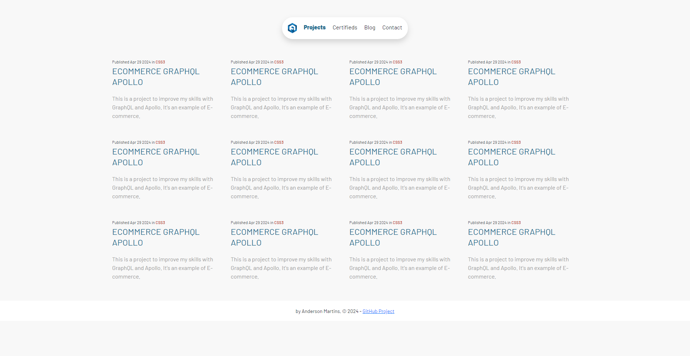
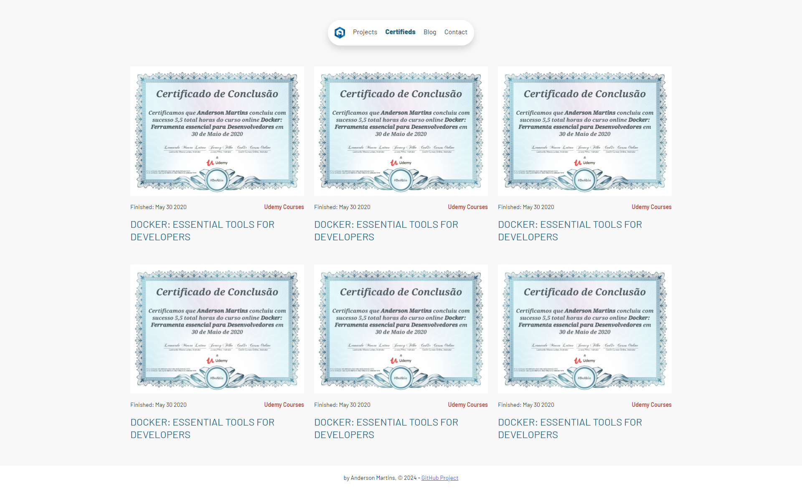
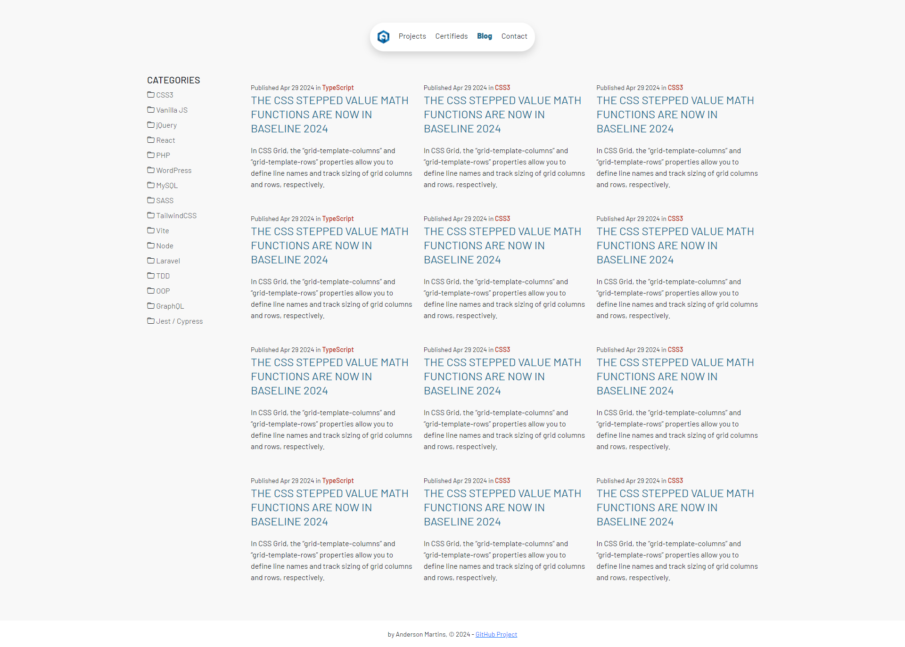

<div align="center">
  
  <h1>Anderson Toledo Martins Moreira</h1>
  <a href="http://www.atmm.dev" target="_blank">Resume Online</a> <br /> <br />
</div>

<!-- References for Create budgets :: https://shields.io/category/build -->
<div align="center">
   
  
  
  
  
  
  
</div>

## Description
New portfolio 2024, created with Bootstrap5.3, Docker, Dockerfile and WordPress using Custom Post Types, Advanced Custom Fields and Elementor.

## Screens Layout
<div align="center">
  Home Page
  
  <br /> <br /> Projects 
  
  <br /> <br /> Certifieds 
  
  <br /> <br /> Blog Articles 
  
</div>

## Programming Languages and Frameworks.
```bash
# PHP / WordPress
# Bootstrap / Bootstrap Icons
# Elementor
# Advanced Custom Fields / Custom Post Types
# Docker / Dockerfile
# Git / Github
```

## System Requirements
```bash
# Git
# Node
# Docker Desktop
# WordPress
```
