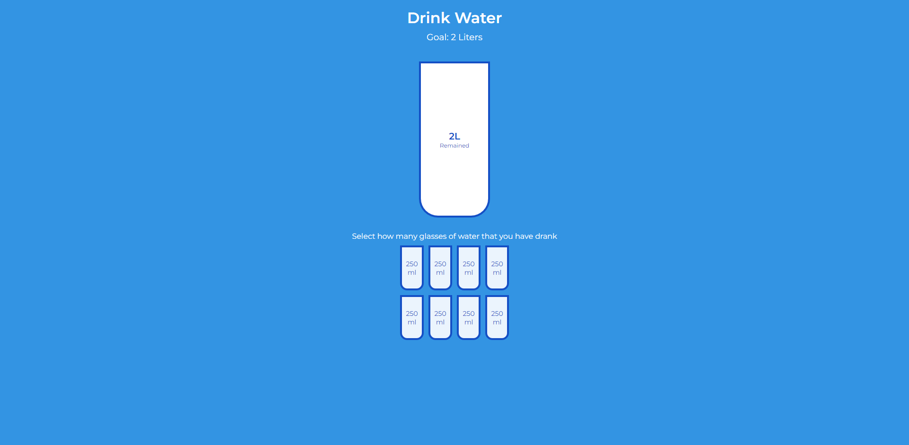

<div align="center">
  
  <h1>Anderson Toledo Martins Moreira</h1>
  <h4> Frontend Software Developer <br />
    <a href="http://www.atmm.dev" target="_blank">Resume Online</a>
  </h4>
</div>

<!-- References for Create budgets :: https://shields.io/category/build -->
<div align="center">
   
  
</div>

## Description
This project is to trainning JavaScript and CSS. <br />
It is a simple project Drink Water.

## Screens Layout
<div align="center">
  
</div>

## Programming Languages and Frameworks.
```bash
# JavaScript
# Node
# Git / Github
```

## System Requirements
```bash
# Git
# Node
```

## Getting Started With Local Development Configuration
```bash
# Download or clone the repository.
# Open the project inside your favorite IDE (I use VSCode).
# To run this project, you need follow some steps.
# 01. run: `npm run install`, to install all dependencies from package.json.
# 02. run: `npm run dev`, if you want to see this project locally. This command will run and open the project in a browser.
# 03. run: `npm run build`. That way you will generate the files to put in PROD, inside the folder dist.
# 04. You will need copy and paste the 'data.json', inside you folder dist (just to put in PROD).
# If you have the extension `Live Server` installed.
# In the folder dist, select the index.html file with the right button of your mouse and select 'Open with Live Server'.
```